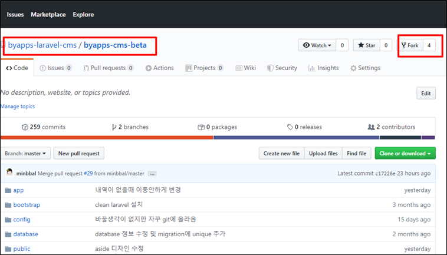
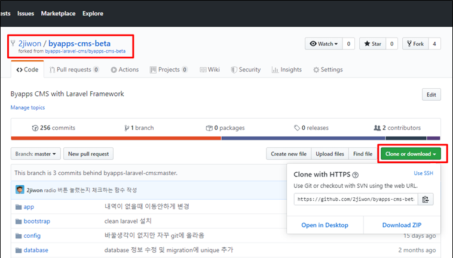
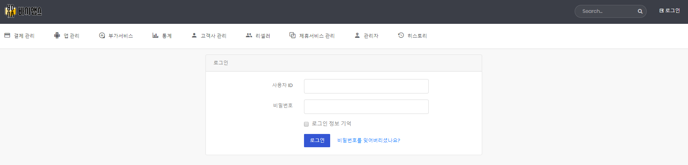

# 1. 개발환경 설정

## 1) 공통 작업 저장소에서 Fork 해서 내 저장소로 가져온다

공통작업 저장소: https://github.com/byapps-laravel-cms/byapps-cms-beta  
!! **주의사항** !! clone 이 아니라 _반드시 Fork 해서_ 먼저 내 저장소를 만들어야한다.



## 2) 내 저장소를 개발서버에 clone 해서 가져온다



## 3) 원격 저장소 추가

```bash
git remote add origin 내 저장소
```

## 4) 권한 설정
storage, bootstrap/cache 디렉토리에 777 권한을 설정한다.

```bash
sudo chmod -R 777 storage
sudo chmod -R 777 bootstrap/cache
```

## 5) composer install

```bash
composer install
```

## 6) .env 파일을 설정한다
폴더 내에 .env.example이 있다. 해당 파일에 아래 파일을 보고 작성한다.   
**중요한 부분은 DB부분**이다.

**예시**
```php
APP_NAME=Laravel
APP_ENV=local
APP_KEY=base64:5vMN4wwN+MjHDqwMXLtLBIcQlr5hj3ReIXkoITRP4mk=  <-- 키는 자동생성임
APP_DEBUG=true
APP_URL=http://ljw2.innoi.kr    <--- 자신의 URL로 변경한다.

LOG_CHANNEL=stack

DB_CONNECTION=mysql
DB_HOST=127.0.0.1
DB_PORT=3306
DB_DATABASE=byapps
DB_USERNAME=유저명
DB_PASSWORD=비밀번호

BROADCAST_DRIVER=log
CACHE_DRIVER=file
QUEUE_CONNECTION=sync
SESSION_DRIVER=file
SESSION_LIFETIME=120

REDIS_HOST=127.0.0.1
REDIS_PASSWORD=null
REDIS_PORT=6379

MAIL_DRIVER=smtp
MAIL_HOST=smtp.mailtrap.io
MAIL_PORT=2525
MAIL_USERNAME=3e8e1ad0ac6f54
MAIL_PASSWORD=bb872f06b22e2d
MAIL_ENCRYPTION=null

AWS_ACCESS_KEY_ID=
AWS_SECRET_ACCESS_KEY=
AWS_DEFAULT_REGION=us-east-1
AWS_BUCKET=

PUSHER_APP_ID=
PUSHER_APP_KEY=
PUSHER_APP_SECRET=
PUSHER_APP_CLUSTER=mt1

MIX_PUSHER_APP_KEY="${PUSHER_APP_KEY}"
MIX_PUSHER_APP_CLUSTER="${PUSHER_APP_CLUSTER}"
```

## 7) 키 생성

```bash
php artisan key:generate
```

이후 지정한 URL로 접속해서 다음과 같은 화면이 뜨면 된다.



기존 CMS의 본인 아이디로 로그인한다.  

## 8) 개발 시작 전 git pull, 개발 완료 후 git push 및 Pull Request 하기
항상 개발 시작하기 전에 다른 개발자들이 올린 변경사항을 내려받기 위해 git push로 공통저장소의 변경사항을 가져온다.

```bash
git pull https://github.com/byapps-laravel-cms/byapps-cms-beta
```

아무리 작은 단위라도 개발이 완료되면 반드시 커밋을 한다. 커밋은 세세할 수록 히스토리가 된다.  
일정 단위의 커밋이 쌓이면 push를 하고 push한 다음에는 PR(Pull Request)를 열고 컨펌을 마친다.  
