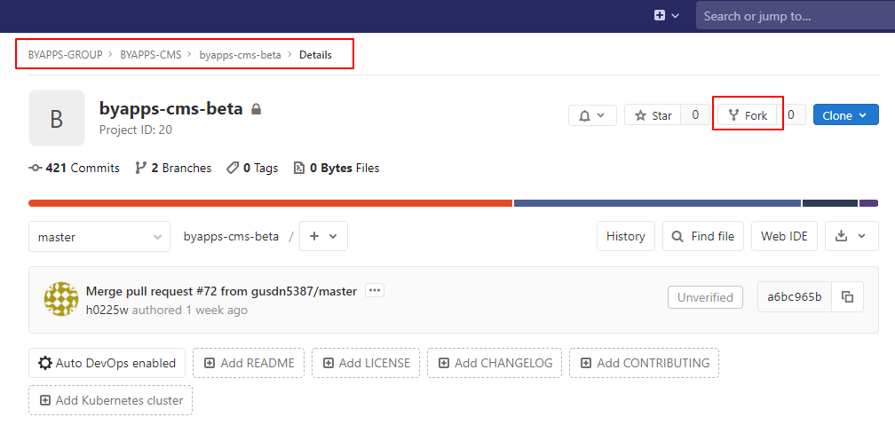
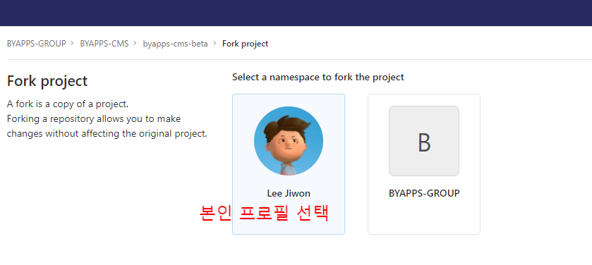
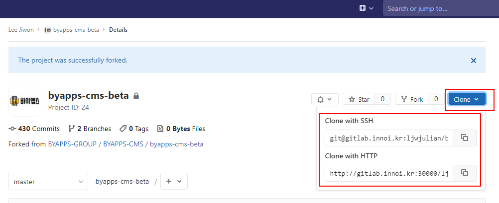

# 1. 개발환경 설정

## 1-1. 기존 github작업자의 경우

### 1) gitlab의 공통 작업 저장소에서 Fork 해서 내 프로젝트로 가져온다

공통 작업 저장소: http://gitlab.innoi.kr:30000/byapps-group/byapps-cms/byapps-cms-beta
!! **주의사항** !! clone 이 아니라 _반드시 Fork 해서_ 먼저 내 저장소를 만들어야한다.

  



### 2) Fork한 프로젝트를 본인 개발 환경 원격 저장소에 추가하거나 변경한다

현재 github 저장소로 origin이 연결되어 있을 것이다.  
github은 관리하고 싶지 않다면 origin을 변경하고, 그렇지 않으면 아래의 방법을 따라한다.

##### A. 기존 origin 저장소 이름을 github으로 이름 변경 (이 부분은 해도 되고 안해도 상관없음)
```bash
git remote rename origin github
```
##### B. gitlab 저장소(clone 저장소) 추가
```bash
git remote add gitlab gitlab저장소의 clone주소(http만 가능)   
```


*만약 SSH로 clone하고 싶은 경우, 다음의 절차가 필요하다.*
- gitlab 본인 계정 settings > SSH Keys에 본인 ssh 공개키 추가
- 개발환경의 ~/.ssh/config 파일 만들고 다음 내용 작성

```bash
Host gitlab.innoi.kr
Hostname gitlab.innoi.kr
User 본인gitlab계정
Port 2020  (<-- 이 포트는 gitlab 설치된 서버의 ssh port가 2020으로 열려있기때문)
```
##### C. A, B 과정을 다 따라한 경우, all 저장소를 추가한 다음, 각각의 url을 배정  
```bash
git remote add all 깃헙저장소
git remote set-url --add --push all 깃헙저장소  
git remote set-url --add --push all 깃랩저장소
```
##### D. ``git remote -v``로  원격저장소를 조회하면 다음과 같다(예시)
```bash
ljw@localhost:~/public_html/byappscms$ git remote -v
all     https://github.com/2jiwon/byapps-cms-beta.git (fetch)
all     https://github.com/2jiwon/byapps-cms-beta.git (push)
all     http://gitlab.innoi.kr:30000/ljwjulian/byapps-cms-beta.git (push)
github  https://github.com/2jiwon/byapps-cms-beta.git (fetch)
github  https://github.com/2jiwon/byapps-cms-beta.git (push)
gitlab  http://gitlab.innoi.kr:30000/ljwjulian/byapps-cms-beta.git (fetch)
gitlab  http://gitlab.innoi.kr:30000/ljwjulian/byapps-cms-beta.git (push)
```
##### E. default upstream을 all 로 지정
```bash
git push -u all
```
이제 git push 명령으로 깃헙과 깃랩 2군데 모두 소스코드가 push된다.

## 1-2. 처음 작업환경 셋팅하는 경우

### 1) gitlab의 공통 작업 저장소에서 Fork 해서 내 프로젝트로 가져온다

공통작업 저장소: http://gitlab.innoi.kr:30000/byapps-group/byapps-cms/byapps-cms-beta
!! **주의사항** !! clone 이 아니라 _반드시 Fork 해서_ 먼저 내 저장소를 만들어야한다.

  


### 2) 내 저장소를 개발서버에 clone해서 가져온다


```bash
git clone gitlab주소
```
### 3) 권한 설정
storage, bootstrap/cache 디렉토리에 777 권한을 설정한다.

```bash
sudo chmod -R 777 storage
sudo chmod -R 777 bootstrap/cache
```

### 4) composer install
```bash
composer install
```
### 5) .env 파일을 설정한다
폴더 내에 .env.example이 있다. 해당 파일을 복사해서 .env 파일을 만든다.  
아래 파일을 참고해서 내용을 작성한다.   
**중요한 부분은 DB부분**이며, 이 부분은 1:1로 확인바람

**예시**
```php
APP_NAME=Laravel
APP_ENV=local
APP_KEY=base64:5vMN4wwN+MjHDqwMXLtLBIcQlr5hj3ReIXkoITRP4mk=  <-- 키는 자동생성임
APP_DEBUG=true
APP_URL=http://ljw2.innoi.kr    <--- 자신의 URL로 변경한다.

LOG_CHANNEL=stack

DB_CONNECTION=mysql
DB_HOST=127.0.0.1
DB_PORT=3306
DB_DATABASE=byapps
DB_USERNAME=유저명
DB_PASSWORD=비밀번호

BROADCAST_DRIVER=log
CACHE_DRIVER=file
QUEUE_CONNECTION=sync
SESSION_DRIVER=file
SESSION_LIFETIME=120

REDIS_HOST=127.0.0.1
REDIS_PASSWORD=null
REDIS_PORT=6379

MAIL_DRIVER=smtp
MAIL_HOST=smtp.mailtrap.io
MAIL_PORT=2525
MAIL_USERNAME=3e8e1ad0ac6f54
MAIL_PASSWORD=bb872f06b22e2d
MAIL_ENCRYPTION=null

AWS_ACCESS_KEY_ID=
AWS_SECRET_ACCESS_KEY=
AWS_DEFAULT_REGION=us-east-1
AWS_BUCKET=

PUSHER_APP_ID=
PUSHER_APP_KEY=
PUSHER_APP_SECRET=
PUSHER_APP_CLUSTER=mt1

MIX_PUSHER_APP_KEY="${PUSHER_APP_KEY}"
MIX_PUSHER_APP_CLUSTER="${PUSHER_APP_CLUSTER}"
```

### 6) 키 생성

```bash
php artisan key:generate
```
이후 지정한 URL로 접속해서 다음과 같은 화면이 뜨면 된다.


기존 CMS의 본인 아이디로 로그인한다.  

### 7) 개발 시작 전 git pull, 개발 완료 후 git push 및 Pull Request 하기
항상 개발 시작하기 전에 다른 개발자들이 올린 변경사항을 내려받기 위해 git pull로 공통저장소의 변경사항을 가져온다.

```bash
git pull https://github.com/byapps-laravel-cms/byapps-cms-beta
```

아무리 작은 단위라도 개발이 완료되면 반드시 커밋을 한다. 커밋은 세세할 수록 히스토리가 된다.  
일정 단위의 커밋이 쌓이면 push를 하고 push한 다음에는 PR(Pull Request)를 열고 컨펌을 마친다.  
